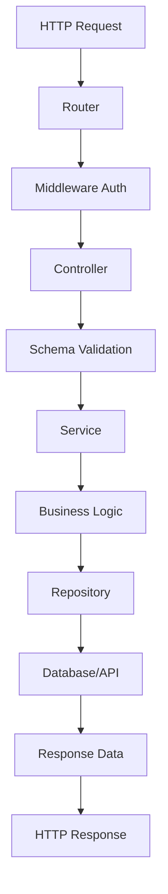

# 🏗️ LaBase Server Project Architecture

## 📋 Table of Contents

1. [Introduction](#introduction)
2. [Architectural Principles](#architectural-principles)
3. [General Structure](#general-structure)
4. [Clean Architecture + Vertical Slices](#clean-architecture--vertical-slices)
5. [Module Anatomy](#module-anatomy)
6. [Architecture Layers](#architecture-layers)
7. [Guide to Create a New Module](#guide-to-create-a-new-module)
8. [Practical Examples](#practical-examples)
9. [Conventions and Best Practices](#conventions-and-best-practices)
10. [Data Flow](#data-flow)

## 🎯 Introduction

LaBase Server implements a hybrid architecture that combines **Clean Architecture** with **Vertical Slices** to create a highly modular, scalable, and maintainable system. This architecture allows developing independent features while maintaining a clear separation of responsibilities.

### Architectural Objectives

- **Separation of Responsibilities**: Each layer has a specific and well-defined responsibility
- **Framework Independence**: Business logic doesn't depend on external technologies
- **Testability**: Facilitates unit and integration testing
- **Flexibility**: Allows infrastructure changes without affecting business logic
- **Scalability**: New features can be added without impacting existing code

## 🏛️ Architectural Principles

### 1. Dependency Inversion Principle (DIP)

- Dependencies point inward (toward business logic)
- External layers depend on internal ones, never the reverse

### 2. Single Responsibility Principle (SRP)

- Each module, class, and function has a single reason to change
- Each feature is independent and self-contained

### 3. Open/Closed Principle (OCP)

- The system is open for extension but closed for modification
- New features are added without modifying existing code

### 4. Separation of Concerns

- Each layer handles specific aspects of the system
- No mixing of responsibilities between layers

## 📁 General Structure

```
src/
├── config/                 # Global system configurations
│   ├── env/               # Environment variables
│   ├── prisma_client/     # ORM client
│   ├── redis/             # Cache configuration
│   ├── email/             # Email configuration
│   └── socket/            # WebSocket configuration
├── constants/             # Global constants
│   ├── http_status_codes/ # HTTP status codes
│   └── messages/          # System messages
├── infrastructure/        # External services and infrastructure
│   ├── aws/              # AWS S3 integration
│   └── jwt/              # JWT token handling
├── middlewares/          # Express middlewares
│   ├── async_handler/    # Async function handling
│   ├── authenticate_token/ # JWT authentication
│   └── multer_error_handler/ # File error handling
├── modules/              # 🎯 BUSINESS MODULES (Vertical Slices)
│   ├── auth/             # Authentication and authorization
│   ├── bot/              # AI chatbot
│   ├── product/          # Product management
│   ├── reservation/      # Reservation system
│   ├── space/            # Space management
│   ├── user/             # User management
│   └── [other modules]/  # Other business modules
├── shared/               # Shared code between modules
│   ├── payments/         # Payment logic
│   └── decolecta/        # RENIEC services integration
├── utils/                # General utilities
│   ├── build_http_response/ # HTTP response builder
│   ├── error_handler/    # Centralized error handling
│   ├── encryption/       # Encryption functions
│   └── [other utilities]/
├── docs/                 # Swagger documentation
├── index.ts              # Main entry point
└── routes.ts             # Global routes configuration
```

## 🔄 Clean Architecture + Vertical Slices

### What are Vertical Slices?

A **Vertical Slice** is a vertical cut through all application layers to implement a specific functionality. Instead of organizing code by technical layers, it's organized by business functionalities.

### Benefits of this Architecture

1. **Self-contained Features**: Each functionality is independent
2. **Lower Coupling**: Modules don't depend on each other
3. **Parallel Development**: Teams can work on different modules simultaneously
4. **Easy Testing**: Each slice can be tested in isolation
5. **Scalability**: New features don't affect existing ones

## 🧩 Module Anatomy

Each module in `src/modules/` follows a consistent structure that implements Clean Architecture layers:

### Base Module Structure

```
src/modules/[module-name]/
├── entities/              # 📦 DOMAIN LAYER
│   └── [entity].entity.ts
├── features/              # 🎯 FEATURES (Vertical Slices)
│   ├── [feature-1]/
│   │   ├── data/         # 💾 DATA LAYER
│   │   │   └── [feature].repository.ts
│   │   ├── domain/       # 📦 DOMAIN LAYER
│   │   │   ├── [feature].dto.ts
│   │   │   └── [feature].schema.ts
│   │   └── presentation/ # 🎨 PRESENTATION LAYER
│   │       ├── [feature].controller.ts
│   │       ├── [feature].service.ts
│   │       └── [feature].routes.ts
│   └── [feature-2]/
│       └── ... # same structure
└── index.ts              # Main module router
```

### Example: Bot Module

```
src/modules/bot/
├── data/
│   ├── api/
│   │   └── bot.api.ts           # Gemini API client
│   └── config/
│       └── bot.config.ts        # Bot configuration
├── domain/
│   ├── dtos/
│   │   └── send_message.dto.ts  # Data Transfer Objects
│   └── schema/
│       └── send_message.schema.ts # Zod validation
└── presentation/
    ├── controllers/
    │   └── bot.controllers.ts    # HTTP controllers
    ├── routes/
    │   └── bot.routes.ts         # Route definitions
    └── services/
        └── bot.service.ts        # Business logic
```

## 🏗️ Architecture Layers

### 📦 Domain Layer

**Responsibility**: Contains pure business logic, entities, and domain rules.

**Characteristics**:

- Doesn't depend on any external technology
- Contains the most important business rules
- Defines contracts (interfaces) for external layers

**Typical files**:

- `entities/` - Domain entities
- `dtos/` - Data Transfer Objects
- `schemas/` - Zod validations
- `interfaces/` - Contracts and abstractions

**Example**:

```typescript
// src/modules/product/features/create_product/domain/create_product.dto.ts
import { z } from "zod";
import { CreateProductSchema } from "./create_product.schema";

export type CreateProductDTO = z.infer<typeof CreateProductSchema>;

export interface CreateProductResponseDTO {
  message: string;
  product_id: string;
}
```

### 🎨 Presentation Layer

**Responsibility**: Handles HTTP communication, input validation, and response formatting.

**Characteristics**:

- Receives HTTP requests and returns responses
- Validates input data using Zod schemas
- Delegates business logic to the service layer
- Handles errors and formats responses

**Typical files**:

- `controllers/` - HTTP controllers
- `routes/` - Express route definitions
- `services/` - Application business logic

**Example**:

```typescript
// src/modules/bot/presentation/controllers/bot.controllers.ts
export class BotController {
  async sendMessage(req: Request, res: Response): Promise<Response> {
    try {
      const data = SendMessageSchema.parse(req.body) as SendMessageDTO;
      const response = await botService.sendMessage(data.message);

      return res
        .status(HttpStatusCodes.OK.code)
        .json(
          buildHttpResponse(
            HttpStatusCodes.OK.code,
            MESSAGES.BOT.SEND_MESSAGE_SUCCESS,
            req.path,
            response
          )
        );
    } catch (error) {
      return handleServerError(res, req, error);
    }
  }
}
```

### 💾 Data Layer

**Responsibility**: Handles data access, external APIs, and persistence.

**Characteristics**:

- Implements Repository patterns for data access
- Handles database connections (Prisma)
- Integrates with external APIs
- Transforms data between formats

**Typical files**:

- `repositories/` - Database access
- `api/` - External API clients
- `config/` - Specific configurations

**Example**:

```typescript
// src/modules/product/features/crud/create_product/data/create_product.repository.ts
export class CreateProductRepository {
  findBrandById(brand_id: string) {
    return prisma.product_brand.findUnique({ where: { id: brand_id } });
  }

  create(data: Prisma.productsCreateInput) {
    return prisma.products.create({ data });
  }
}
```

## 🚀 Guide to Create a New Module

### Step 1: Planning

Before creating the module, define:

1. **Module name** (singular, kebab-case)
2. **Main features** it will include
3. **Domain entities** involved
4. **Required HTTP endpoints**

### Step 2: Create Base Structure

```bash
mkdir -p src/modules/[module-name]/{entities,features}
touch src/modules/[module-name]/index.ts
```

### Step 3: Define Entities (if applicable)

```typescript
// src/modules/[module-name]/entities/[entity].entity.ts
export interface [Entity] {
  id: string;
  // ... other properties
  created_at: Date;
  updated_at: Date;
}
```

### Step 4: Create First Feature

```bash
mkdir -p src/modules/[module-name]/features/[feature-name]/{data,domain,presentation}
```

### Step 5: Implement Layers

#### 5.1 Domain Layer

```typescript
// domain/[feature].schema.ts
import { z } from "zod";

export const [Feature]Schema = z.object({
  // validations
});

// domain/[feature].dto.ts
export type [Feature]DTO = z.infer<typeof [Feature]Schema>;
```

#### 5.2 Data Layer

```typescript
// data/[feature].repository.ts
export class [Feature]Repository {
  async create(data: [Feature]DTO) {
    return prisma.[table].create({ data });
  }

  async findById(id: string) {
    return prisma.[table].findUnique({ where: { id } });
  }
}
```

#### 5.3 Presentation Layer

```typescript
// presentation/[feature].service.ts
export class [Feature]Service {
  constructor(private repository = new [Feature]Repository()) {}

  async execute(dto: [Feature]DTO) {
    // business logic
    return this.repository.create(dto);
  }
}

// presentation/[feature].controller.ts
export class [Feature]Controller {
  constructor(private service = new [Feature]Service()) {}

  async handle(req: Request, res: Response) {
    const dto = [Feature]Schema.parse(req.body);
    const result = await this.service.execute(dto);

    return res.status(201).json(
      buildHttpResponse(201, "Success", req.path, result)
    );
  }
}

// presentation/[feature].routes.ts
const router = Router();
const controller = new [Feature]Controller();

router.post("/", asyncHandler(controller.handle.bind(controller)));

export { router as [feature]Routes };
```

### Step 6: Configure Main Router

```typescript
// src/modules/[module-name]/index.ts
import { Router } from "express";
import { [feature]Routes } from "./features/[feature]/presentation/[feature].routes";

export const [module]Router = Router();

[module]Router.use("/", [feature]Routes);

export default [module]Router;
```

### Step 7: Register in Global Routes

```typescript
// src/routes.ts
import { [module]Router } from "./modules/[module-name]";

router.use("/api/v1/[module-name]", [module]Router);
```

## 📚 Practical Examples

### Example 1: Bot Module (Simple)

The `bot` module is a simple example with a single feature:

```
src/modules/bot/
├── data/
│   ├── api/bot.api.ts           # Gemini API client
│   └── config/bot.config.ts     # Chatbot configuration
├── domain/
│   ├── dtos/send_message.dto.ts # Data types
│   └── schema/send_message.schema.ts # Validation
└── presentation/
    ├── controllers/bot.controllers.ts # HTTP Controller
    ├── routes/bot.routes.ts          # Express routes
    └── services/bot.service.ts       # Business logic
```

**Data flow**:

1. `POST /api/v1/chatbot/send-message`
2. `bot.routes.ts` → `bot.controllers.ts`
3. `bot.controllers.ts` → `bot.service.ts`
4. `bot.service.ts` → `bot.api.ts` (Gemini)
5. API Response → Service → Controller → HTTP Response

### Example 2: Product Module (Complex)

The `product` module has multiple features organized by functionality:

```
src/modules/product/
├── features/
│   ├── crud/                    # Basic product CRUD
│   │   ├── create_product/
│   │   │   ├── data/create_product.repository.ts
│   │   │   ├── domain/create_product.{dto,schema}.ts
│   │   │   └── presentation/create_product.{controller,service,routes}.ts
│   │   ├── edit_product/
│   │   ├── delete_product/
│   │   └── get_products/
│   └── brand/                   # Brand management
│       ├── create_brand/
│       ├── edit_brand/
│       ├── delete_brand/
│       └── get_brand/
└── index.ts                    # Router combining all features
```

**Main router**:

```typescript
// src/modules/product/index.ts
export const productRouter = Router();

// Product CRUD
productRouter.use("/", createProductRoutes);
productRouter.use("/", editProductRoutes);
productRouter.use("/", deleteProductRoutes);
productRouter.use("/", getProductsRoutes);

// Brand routes
export const productBrandRouter = Router();
productBrandRouter.use("/", createBrandRoutes);
productBrandRouter.use("/", editBrandRoutes);
// ...
```

### Example 3: Module with Complex Features

```
src/modules/reservation/
├── entities/reservation.entity.ts
├── features/
│   ├── create_reservation/      # Create reservation
│   ├── cancel_reservation/      # Cancel reservation
│   ├── confirm_payment/         # Confirm payment
│   ├── generate_qr/            # Generate QR code
│   ├── validate_access/        # Validate space access
│   └── list_user_reservations/ # List user reservations
└── index.ts
```

## 📝 Conventions and Best Practices

### Naming

#### Files and Directories

- **Modules**: `kebab-case` (e.g., `user-management`)
- **Features**: `snake_case` (e.g., `create_product`)
- **Files**: `[feature].[type].ts` (e.g., `create_product.controller.ts`)

#### Classes and Types

- **Classes**: `PascalCase` (e.g., `CreateProductController`)
- **Interfaces**: `PascalCase` with `I` prefix (e.g., `IProductRepository`)
- **DTOs**: `PascalCase` with `DTO` suffix (e.g., `CreateProductDTO`)
- **Schemas**: `PascalCase` with `Schema` suffix (e.g., `CreateProductSchema`)

### File Structure

#### Controller Pattern

```typescript
export class [Feature]Controller {
  constructor(private readonly service = new [Feature]Service()) {}

  async handle(req: AuthenticatedRequest, res: Response) {
    try {
      // 1. Validate input
      const dto = [Feature]Schema.parse(req.body);

      // 2. Extract authenticated user (if applicable)
      const user = await getAuthenticatedUser(req);

      // 3. Execute business logic
      const result = await this.service.execute(dto, user);

      // 4. Format response
      return res.status(HttpStatusCodes.CREATED.code).json(
        buildHttpResponse(
          HttpStatusCodes.CREATED.code,
          result.message,
          req.path,
          result.data
        )
      );
    } catch (error) {
      if (error instanceof ZodError) {
        const createdError = handleZodError(error, req);
        return res.status(createdError.status).json(createdError);
      }
      return handleServerError(res, req, error);
    }
  }
}
```

#### Service Pattern

```typescript
export class [Feature]Service {
  constructor(private readonly repository = new [Feature]Repository()) {}

  async execute(dto: [Feature]DTO, user?: AuthenticatedUser): Promise<[Feature]ResponseDTO> {
    // 1. Business validations
    await this.validateBusinessRules(dto, user);

    // 2. Transform data if necessary
    const transformedData = this.transformData(dto);

    // 3. Persist/obtain data
    const result = await this.repository.create(transformedData);

    // 4. Return structured response
    return {
      message: MESSAGES.[MODULE].[FEATURE]_SUCCESS,
      data: result
    };
  }

  private async validateBusinessRules(dto: [Feature]DTO, user?: AuthenticatedUser) {
    // Specific business validations
  }

  private transformData(dto: [Feature]DTO) {
    // Necessary transformations
    return dto;
  }
}
```

#### Repository Pattern

```typescript
export class [Feature]Repository {
  async create(data: Prisma.[Model]CreateInput): Promise<[Model]> {
    return prisma.[model].create({ data });
  }

  async findById(id: string): Promise<[Model] | null> {
    return prisma.[model].findUnique({ where: { id } });
  }

  async findMany(filters: [Feature]FiltersDTO): Promise<[Model][]> {
    return prisma.[model].findMany({
      where: this.buildFilters(filters),
      orderBy: { created_at: 'desc' }
    });
  }

  private buildFilters(filters: [Feature]FiltersDTO) {
    // Build Prisma filters
    return {};
  }
}
```

### Zod Validation

```typescript
// domain/[feature].schema.ts
import { z } from "zod";

export const [Feature]Schema = z.object({
  name: z.string().min(1, "Name is required").max(100, "Name too long"),
  email: z.string().email("Invalid email format"),
  age: z.number().min(18, "Must be 18 or older").optional(),
  tags: z.array(z.string()).max(5, "Maximum 5 tags allowed")
});

export const [Feature]FiltersSchema = z.object({
  search: z.string().optional(),
  page: z.number().min(1).default(1),
  limit: z.number().min(1).max(100).default(10)
});
```

### Error Handling

```typescript
// utils/errors/custom-errors.ts
export class BusinessLogicError extends Error {
  constructor(message: string, public statusCode: number = 400) {
    super(message);
    this.name = "BusinessLogicError";
  }
}

export class NotFoundError extends Error {
  constructor(resource: string) {
    super(`${resource} not found`);
    this.name = "NotFoundError";
  }
}
```

### Swagger Documentation

```typescript
/**
 * @openapi
 * /api/v1/[module]/[endpoint]:
 *   post:
 *     tags:
 *       - [Module]
 *     summary: [Feature description]
 *     security:
 *       - bearerAuth: []
 *     requestBody:
 *       required: true
 *       content:
 *         application/json:
 *           schema:
 *             $ref: '#/components/schemas/[Feature]Schema'
 *     responses:
 *       201:
 *         description: [Feature] created successfully
 *         content:
 *           application/json:
 *             schema:
 *               $ref: '#/components/schemas/[Feature]Response'
 *       400:
 *         description: Validation error
 *       401:
 *         description: Unauthorized
 */
```

## 🔄 Data Flow

### Typical Request Flow



### 1. HTTP Request

- Client sends HTTP request
- Express.js receives the request

### 2. Router

- Routes the request to the correct controller
- Applies route-specific middlewares

### 3. Middleware

- JWT authentication (if required)
- Permission validation
- File processing (Multer)

### 4. Controller

- Validates input data with Zod
- Extracts authenticated user information
- Delegates business logic to Service

### 5. Service

- Implements business rules
- Coordinates operations between repositories
- Handles data transformations

### 6. Repository

- Data access (Prisma ORM)
- External API queries
- Persistence operations

### 7. Response

- HTTP response formatting
- Error handling
- Logging and auditing

## 🎯 Special Considerations

### Modules with Complex States

For modules that handle complex flows (such as reservations with states):

```typescript
// entities/reservation.entity.ts
export enum ReservationStatus {
  PENDING = "pending",
  CONFIRMED = "confirmed",
  CANCELLED = "cancelled",
  IN_PROGRESS = "in_progress",
}

// services/reservation-state.service.ts
export class ReservationStateService {
  async validateStateTransition(
    currentStatus: ReservationStatus,
    newStatus: ReservationStatus
  ): Promise<boolean> {
    const validTransitions = {
      [ReservationStatus.PENDING]: [
        ReservationStatus.CONFIRMED,
        ReservationStatus.CANCELLED,
      ],
      [ReservationStatus.CONFIRMED]: [
        ReservationStatus.IN_PROGRESS,
        ReservationStatus.CANCELLED,
      ],
      [ReservationStatus.IN_PROGRESS]: [],
      [ReservationStatus.CANCELLED]: [],
    };

    return validTransitions[currentStatus]?.includes(newStatus) ?? false;
  }
}
```

### Integration with External Services

```typescript
// shared/payments/providers/niubiz.provider.ts
export class NiubizPaymentProvider implements IPaymentProvider {
  async createPayment(
    amount: number,
    metadata: PaymentMetadata
  ): Promise<PaymentResponse> {
    // Niubiz-specific implementation
  }

  async confirmPayment(transactionId: string): Promise<PaymentConfirmation> {
    // Payment confirmation
  }
}

// modules/payment/features/create-payment/presentation/create-payment.service.ts
export class CreatePaymentService {
  constructor(
    private paymentProvider: IPaymentProvider = new NiubizPaymentProvider()
  ) {}

  async execute(dto: CreatePaymentDTO): Promise<CreatePaymentResponseDTO> {
    // Use abstract provider
    const payment = await this.paymentProvider.createPayment(
      dto.amount,
      dto.metadata
    );
    // ...
  }
}
```

### Events and Notifications

```typescript
// shared/events/event-emitter.ts
export class EventEmitter {
  private static instance: EventEmitter;
  private events: Map<string, Function[]> = new Map();

  static getInstance(): EventEmitter {
    if (!EventEmitter.instance) {
      EventEmitter.instance = new EventEmitter();
    }
    return EventEmitter.instance;
  }

  emit(event: string, data: any): void {
    const handlers = this.events.get(event) || [];
    handlers.forEach((handler) => handler(data));
  }

  on(event: string, handler: Function): void {
    const handlers = this.events.get(event) || [];
    handlers.push(handler);
    this.events.set(event, handlers);
  }
}

// modules/reservation/features/confirm_reservation/presentation/confirm_reservation.service.ts
export class ConfirmReservationService {
  private eventEmitter = EventEmitter.getInstance();

  async execute(
    dto: ConfirmReservationDTO
  ): Promise<ConfirmReservationResponseDTO> {
    const reservation = await this.repository.confirm(dto.id);

    // Emit event for notifications
    this.eventEmitter.emit("reservation.confirmed", {
      reservationId: reservation.id,
      userId: reservation.user_id,
      spaceId: reservation.space_id,
    });

    return { message: "Reservation confirmed", reservation };
  }
}
```

## 🧪 Testing Strategy

### Unit Tests

```typescript
// __tests__/modules/product/create-product.service.test.ts
describe("CreateProductService", () => {
  let service: CreateProductService;
  let mockRepository: jest.Mocked<CreateProductRepository>;

  beforeEach(() => {
    mockRepository = {
      create: jest.fn(),
      findBrandById: jest.fn(),
    } as any;
    service = new CreateProductService(mockRepository);
  });

  it("should create a product successfully", async () => {
    // Arrange
    const dto: CreateProductDTO = { name: "Test Product", brand_id: "brand-1" };
    mockRepository.findBrandById.mockResolvedValue({
      id: "brand-1",
      name: "Test Brand",
    });
    mockRepository.create.mockResolvedValue({ id: "product-1", ...dto });

    // Act
    const result = await service.execute(dto);

    // Assert
    expect(result.product_id).toBe("product-1");
    expect(mockRepository.create).toHaveBeenCalledWith(dto);
  });
});
```

### Integration Tests

```typescript
// __tests__/integration/product.integration.test.ts
describe("Product API Integration", () => {
  beforeEach(async () => {
    await setupTestDatabase();
  });

  it("POST /api/v1/products should create a product", async () => {
    const response = await request(app)
      .post("/api/v1/products")
      .set("Authorization", `Bearer ${validToken}`)
      .send({
        name: "Test Product",
        brand_id: "valid-brand-id",
      });

    expect(response.status).toBe(201);
    expect(response.body.data.name).toBe("Test Product");
  });
});
```

## 📊 Metrics and Monitoring

### Health Checks

```typescript
// modules/health/presentation/health.controller.ts
export class HealthController {
  async checkHealth(req: Request, res: Response) {
    const checks = await Promise.allSettled([
      this.checkDatabase(),
      this.checkRedis(),
      this.checkExternalAPIs(),
    ]);

    const status = checks.every((check) => check.status === "fulfilled")
      ? "healthy"
      : "unhealthy";

    return res.json({
      status,
      timestamp: new Date().toISOString(),
      checks: checks.map((check, index) => ({
        service: ["database", "redis", "external-apis"][index],
        status: check.status,
        message: check.status === "fulfilled" ? "OK" : (check as any).reason,
      })),
    });
  }
}
```

## 🚀 Deployment and Scalability

### Production Preparation

1. **Environment variables**: Configure all necessary variables
2. **Migrations**: Run `prisma migrate deploy`
3. **Build**: Compile TypeScript with `npm run build`
4. **Health checks**: Configure health endpoints
5. **Logging**: Implement structured logging
6. **Monitoring**: Configure metrics and alerts

### Horizontal Scalability

The architecture allows horizontal scalability in several ways:

1. **Independent modules**: Each module can be deployed separately
2. **Microservices**: Modules can be converted to microservices
3. **Load balancing**: Multiple instances can be load balanced
4. **Database sharding**: Data can be partitioned by module

---

This architecture provides a solid foundation for long-term growth and maintenance of the LaBase Server project. The combination of Clean Architecture with Vertical Slices enables agile development while maintaining code quality and scalability.
